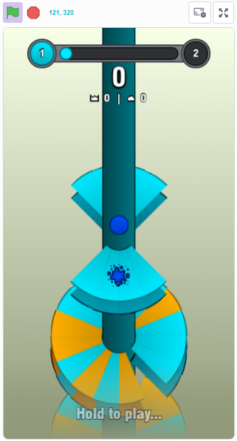
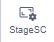
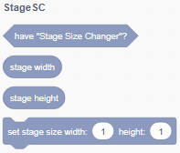

 

# Stage Size Changer

---

## 🔎 About:
"Stage Size Changer" is a userscript for the 
[^1] and  websites that allows you to change the stage size from 480×360 to something else

> [!WARNING]
> Userscript is currently in alpha release and may be unstable!

### Example with 360×640 stage size:

## ✨ Features:
* VM patches related to adding the ability to resize the stage
* A button in the stage controls to resize the stage
* A label in the stage controls that shows the position of the mouse cursor on the stage
* Resizing the stage according to \_twconfig\_
* New category "StageSC"  and blocks:

`have "Stage Size Changer"?`, `stage width`, `stage height`, `set stage size width: () height: ()`

## 📦 Installization:
1. Install the userscript manager like 
2. Install userscript from:
    * [Direct link (latest release)](https://raw.githubusercontent.com/DDen4ik-12/Stage-Size-Changer/refs/heads/main/stageSizeChanger.user.js)
    * [Releases](https://github.com/DDen4ik-12/Stage-Size-Changer/releases)

[^1]: Scratch is a project of the Scratch Foundation. It is available for free at https://scratch.org/
